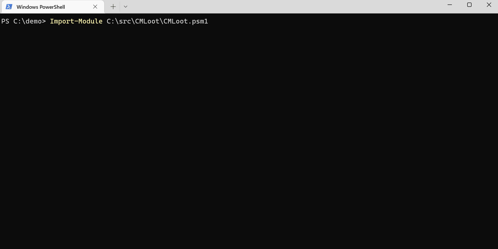
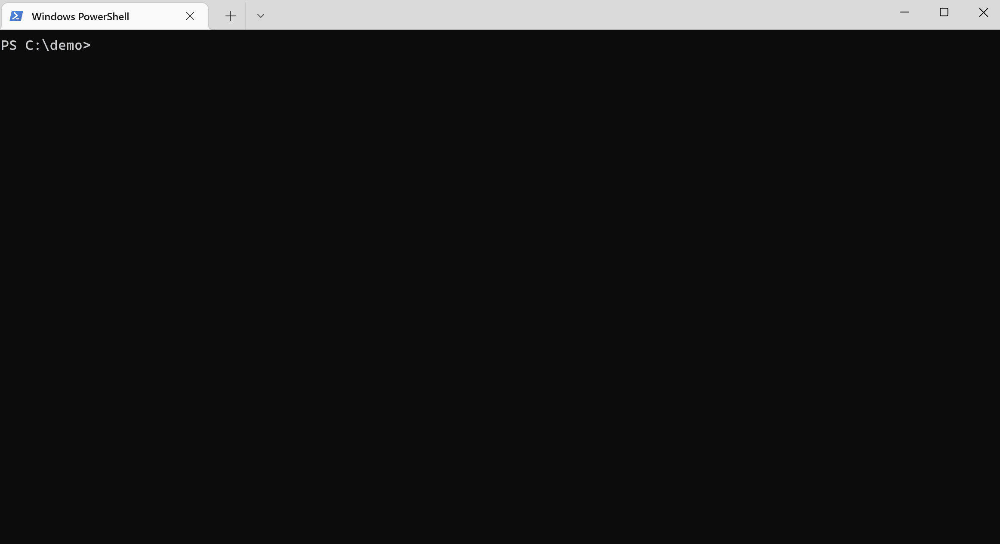
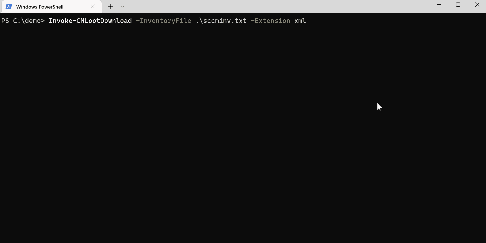
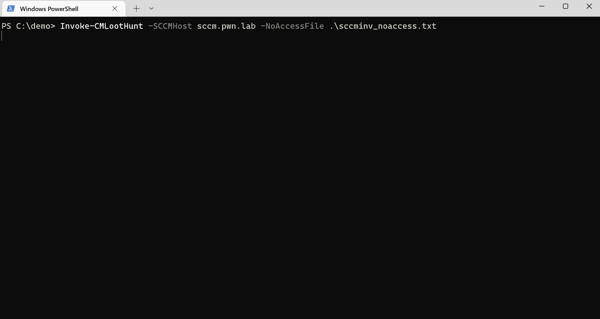

# CMLoot
CMLoot was created to easily find interesting files stored on System Center Configuration Manager (SCCM/CM) SMB shares. The shares are used for distributing software to Windows clients in Windows enterprise environments and can contains scripts/configuration files with passwords, certificates (pfx), etc. Most SCCM deployments are configured to allow all users to read the files on the shares, sometimes it is limited to computer accounts.

The Content Library of SCCM/CM have a "complex" (annoying) file structure which CMLoot will untangle for you:
https://techcommunity.microsoft.com/t5/configuration-manager-archive/understanding-the-configuration-manager-content-library/ba-p/273349

Essentially the DataLib folder contains .INI files, the .INI file are named the original filename + .INI.
The .INI file contains a hash of the file, and the file itself is stored in the FileLib in format of <folder name: 4 first chars of the hash>\fullhash.

### CM Access Accounts
It is possible to apply Access control to packages in CM. This however only protects the folder for the file descriptor (DataLib), not the actual file itself. CMLoot will during inventory record any package that it can't access (Access denied) to the file <inventoryfile>_noaccess.txt. Invoke-CMLootHunt can then use this file to enumerate the actual files that the access control is trying to protect.


### OPSEC
Windows Defender for Endpoint (EDR) or other security mechanisms might trigger because the script parses a lot of files over SMB.

### HOWTO
Find CM servers by searching for them  in Active Directory or by fetching this reqistry key on a workstation with System Center installed:
```
(Get-ItemProperty -Path HKLM:\SOFTWARE\Microsoft\SMS\DP -Name ManagementPoints).ManagementPoints
```

There may be multiple CM servers deployed and they can contain different files so be sure to find all of them.


Then you need to create an inventory file which is just a text file containing references to file descriptors (.INI).
The following command will parse all .INI files on the SCCM server to create a list of files available.
```
PS> Invoke-CMLootInventory -SCCMHost sccm01.domain.local -Outfile sccmfiles.txt
```


Then use the inventory file created above to download files of interest:

Select files using GridView (Milage may vary with large inventory files):

```
PS> Invoke-CMLootDownload -InventoryFile .\sccmfiles.txt -GridSelect
```

Download a single file, by coping a line in the inventory text:

```
PS> Invoke-CMLootDownload -SingleFile \\sccm\SCCMContentLib$\DataLib\SC100001.1\x86\MigApp.xml
```

Download all files with a certain file extension:
```
PS> Invoke-CMLootDownload -InventoryFile .\sccmfiles.txt -Extension ps1
```

Files will by default download to CMLootOut in the folder from which you execute the script, can be changed with -OutFolder parameter. Files are saved in the format of (folder: filext)\\(first 4 chars of hash>_original filename).

Hunt for files that CMLootInventory found inaccessible:
```
Invoke-CMLootHunt -SCCMHost sccm -NoAccessFile sccmfiles_noaccess.txt
```

Bulk extract MSI files:
```
Invoke-CMLootExtract -Path .\CMLootOut\msi
```


### DEMO

Run inventory, scanning available files:


Select files using GridSelect:


Download all extensions:


Hunt "inaccessible" files and MSI extract:



### Author
Tomas Rzepka / WithSecure
